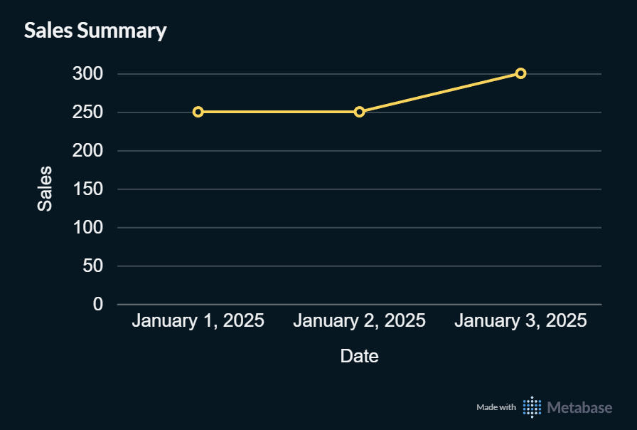

# 销售数据自动化管道

## 项目简介

这是一个从原始数据到可视化看板的完整数据管道项目。实现了数据抽取、转换、加载（ETL）的自动化流程，最终通过 Metabase 生成可视化报表。

## 技术栈

- Python 3.11 + pandas（数据处理）
- PostgreSQL 15（数据存储）
- psycopg 3（数据库连接）
- Metabase（可视化）
- Docker（容器化部署）

## 项目架构
data.csv → Python/pandas → PostgreSQL → Metabase 看板


## 快速开始

### 1. 安装依赖
```bash
pip install pandas psycopg
```
###2. 准备数据
确保 data.csv 存在：
```
date,sales
2025-01-01,100
2025-01-01,150
2025-01-02,200
```
###3. 配置 PostgreSQL
```
安装 PostgreSQL 15
用户名：postgres
密码：123456
数据库：postgres
```
###4. 运行 ETL 脚本
```
python run.py
```
###5. 启动 Metabase
```
docker run -d -p 3000:3000 --name metabase metabase/metabase
```
###6. 访问 Metabase
浏览器打开 http://localhost:3000

添加数据库连接：
```
Host：host.docker.internal
Port：5432
Database：postgres
Username：postgres
Password：123456
```
###成果展示


常见问题\
Q：Metabase 无法连接数据库？\
A：检查 Host 是否填了 host.docker.internal，不是 localhost。

Q：pandas 导入失败？\
A：运行 pip install pandas。

作者
刘垒
